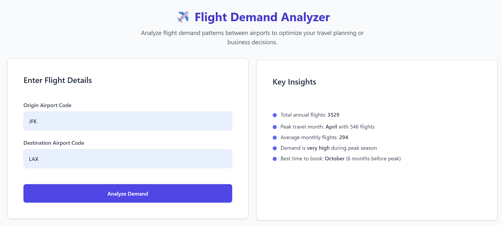
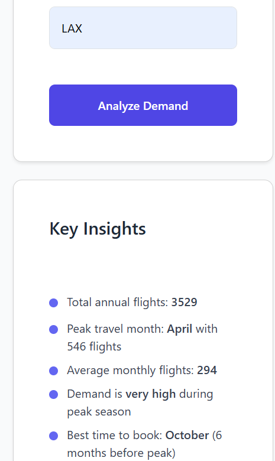
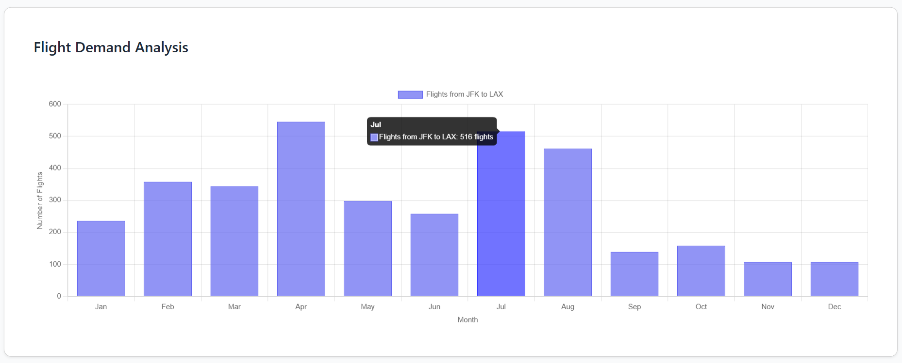
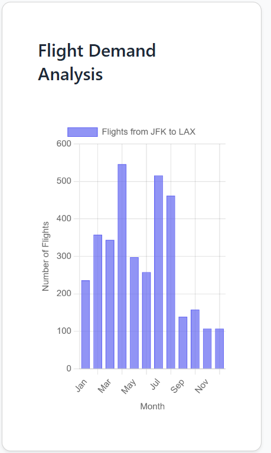

# ✈️ Flight Demand Analyzer

A **Python + Flask** web app to analyze airline booking market demand.
Currently uses **simulated random data**, but supports **real API integration** (e.g., [AviationStack](https://aviationstack.com/)) for future expansion.

---

## **Features**

* Simulates flight demand analysis between origin and destination airports
* Generates **key insights**, including:

  * Total annual flights
  * Peak travel month
  * Average monthly flights
  * Best time to book
* **Interactive bar chart visualization** using Chart.js
* **Ready for real-world API integration** (aviation/travel APIs)

---

## **Folder Structure**

```
flight-demand-analyzer/
│
├── app.py                  # Flask main app
├── requirements.txt        # Python dependencies
├── templates/
│   └── index.html          # Web interface
└── utils/
    ├── scraper.py          # Fetch/simulate flight data
    └── analyzer.py         # Analyze and generate insights
```

---

## **Installation & Usage**

1. **Clone the repository**:

   ```bash
   git clone https://github.com/coderyashu09/flight-demand-analyzer.git
   cd flight-demand-analyzer
   ```

2. **Install dependencies**:

   ```bash
   pip install -r requirements.txt
   ```

3. **Run the Flask app**:

   ```bash
   python app.py
   ```

4. **Open the app** in your browser:

   ```
   http://127.0.0.1:5000
   ```

---

## **Demo Screenshots**

1. Homepage:
   
2. responsive Homepage:
   
3. Analysis Result:
   
4. responsive Analysis Result:
   

---

## **Future Improvements**

* Integrate with **real-time flight APIs**
* Save historical data to **database** for trend analysis
* Add **price tracking** and **prediction models**

